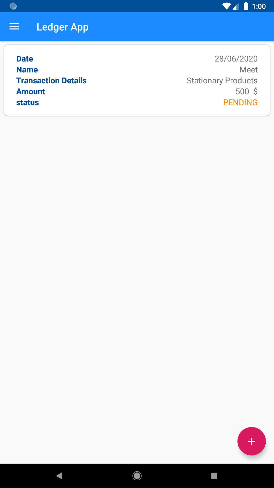
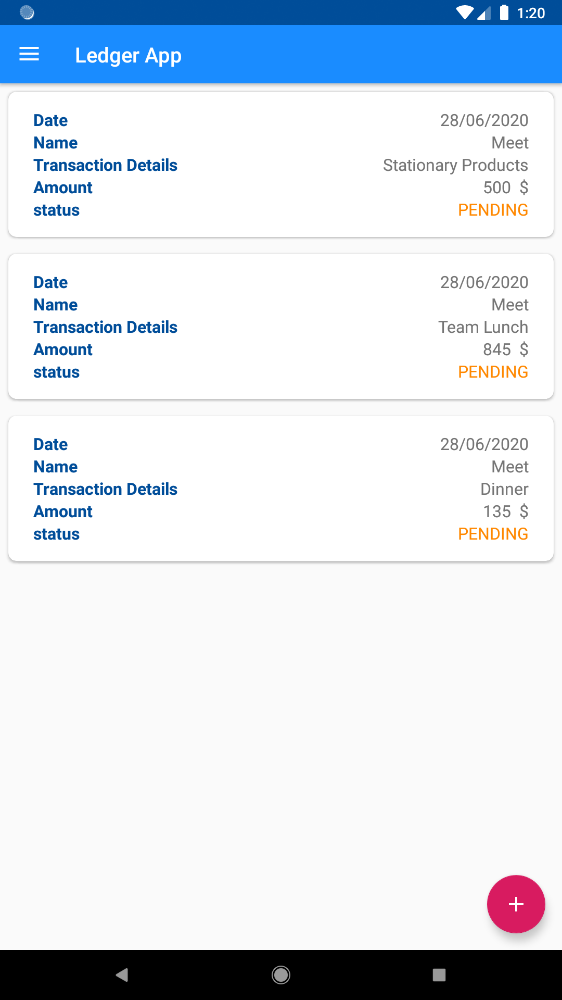

# Ledger-App

A simple Ledger App

**Features:** 
- Login with your Google.
- Simply click on the button to add your ledger details.
- Delete functionality also available for remove any ledger details.
- History of our ledger details.

**Topic covers in Android:**
- Real Time Database
- Recycler View
- MVVM
- Live data

**ScreenShots of App:**

  
  

  
  

  
  

  
  

  

